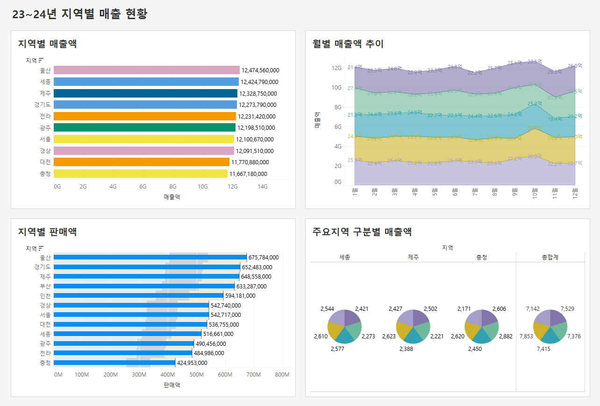
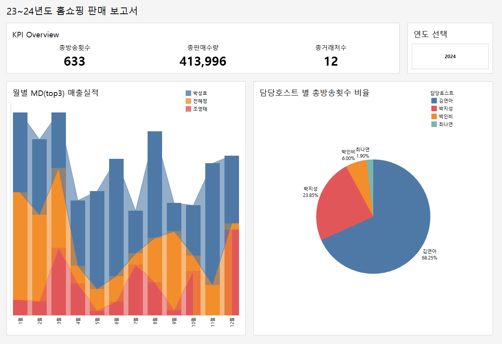
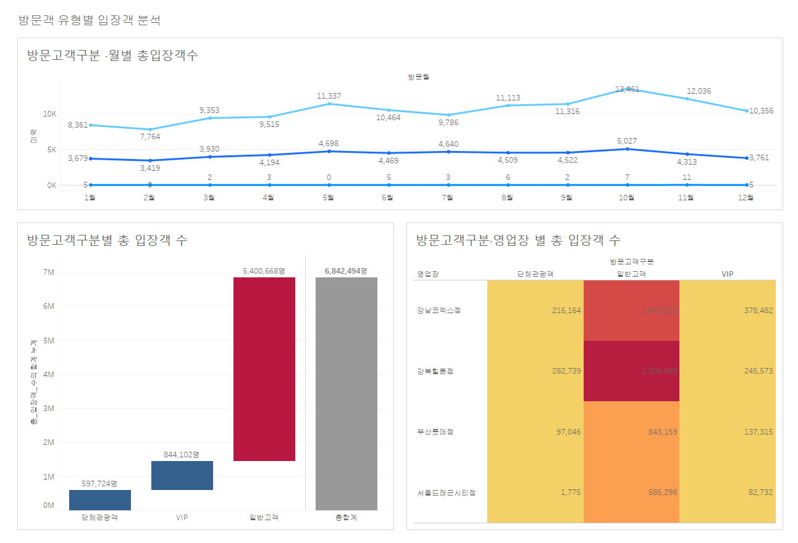
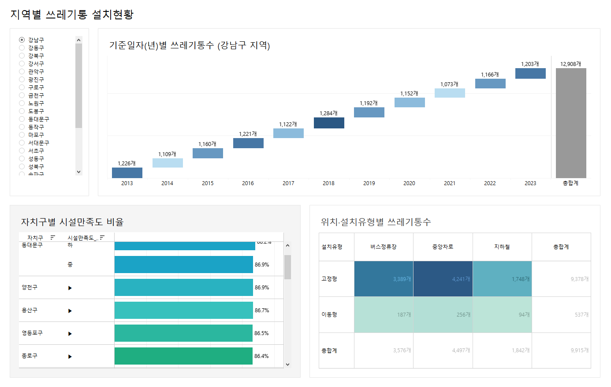

# Tableau_Study
---
다양한 도메인의 데이터를 바탕으로 여러 형태의 Tableau 대시보드를 제작한 학습 기록 저장소입니다.  

실제 실무에서 사용하는 형태의 지표 구성, KPI 카드, 필터/파라미터,  
차트 조합(Line, Bar, Area, Scatter, Heatmap 등)을 직접 구현하며  
**대시보드 설계 능력과 시각화 경험을 쌓는 것**을 목표로 했습니다.

---

## 📊 Example Dashboards (대표 캡처)
아래 이미지는 프로젝트에서 제작한 여러 대시보드 중 일부 예시입니다.  
각 도메인(호텔 예약, 홈쇼핑, 지역 매출, 방문객 분석, 공공시설 등)에 맞춰  
다양한 시각화 유형과 대시보드 레이아웃을 구현했습니다.

### ▶ 호텔 예약 트렌드 분석 예시

### ▶ 홈쇼핑 KPI 및 판매 분석

### ▶ 방문객 유형·지역 기반 분석

### ▶ 지역별 수거함 및 만족도 분석

---

## 🧰 What I Practiced
- KPI 카드, 지표 테이블, 텍스트 히트맵, 하이라이트 테이블 구현
- 막대형, 라인형, 면적차트, 파이차트, 스캐터 플롯(산점도) 등 다양한 기본 차트 실습
- 버블 차트, 워드클라우드, 트리맵, 히트맵 등 비정형 시각화 실습
- 워터폴 차트(누적 변화 분석) 구성 연습
- 필터/파라미터(연월, 기준일자, 지표 선택, 지역 선택 등)를 활용한 동적 분석 대시보드 설계
- 계산 필드 / Table Calculation(YoY, 비율, 누계 등)을 통한 지표 재가공
- 데이터 모델 구성 및 시트 간 상호작용(액션 필터/하이라이트) 설계
- 사용자 가독성과 UX를 고려한 레이아웃·타이틀·컬러 시스템 통일

---

## 📁 Repository Structure

Tableau_Study/
├─ dashboards/        # Tableau .twb / .twbx 파일
├─ images/            # 대표 대시보드 캡처 이미지
└─ README.md

---

본 레포지토리는 Tableau 숙련도를 높이기 위해  
직접 다양한 형태의 대시보드를 설계·제작하며 정리한 학습 공간입니다.
